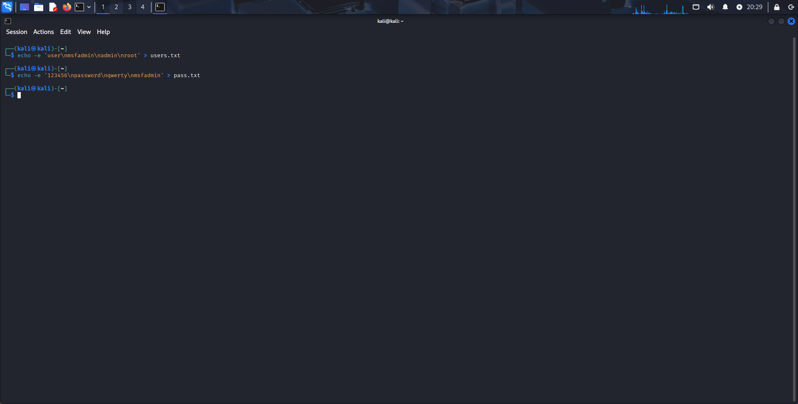
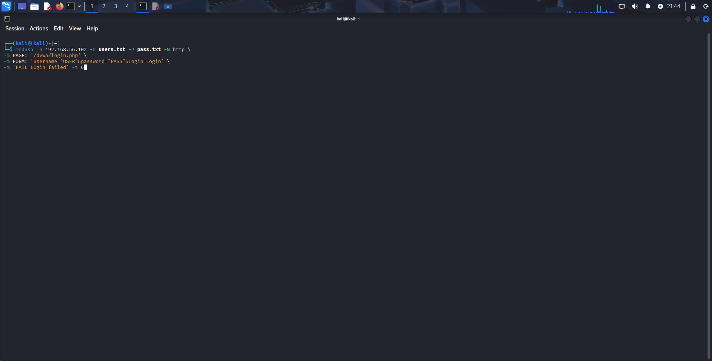
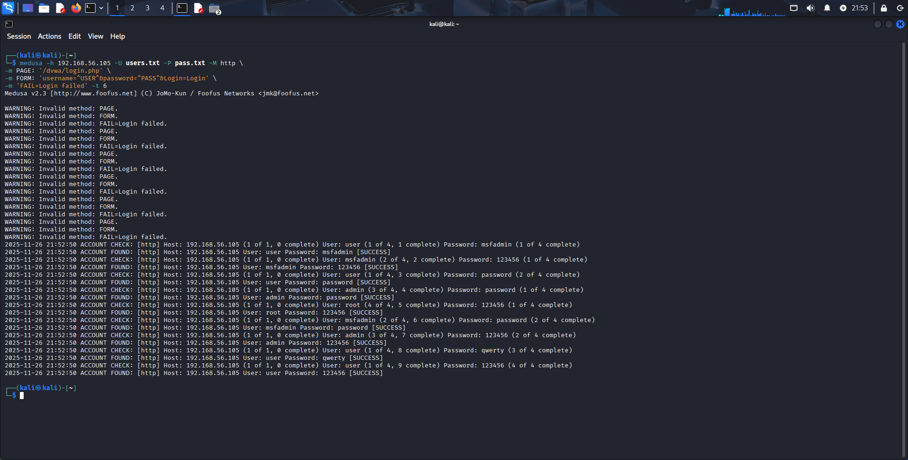
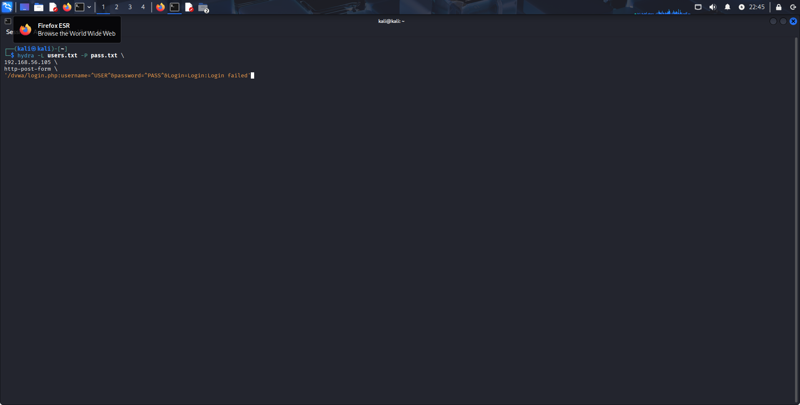
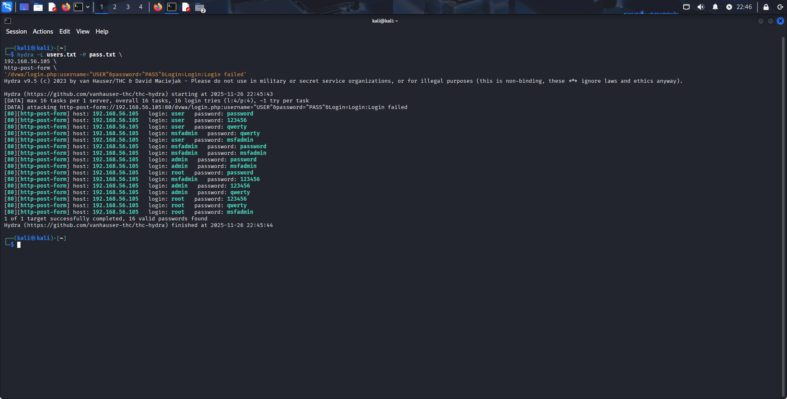

# Prática 1 – Ataque de Força Bruta em FTP usando Kali Linux + Medusa

Este laboratório tem como objetivo realizar um ataque de **força bruta no serviço FTP**
do Metasploitable 2, utilizando o Kali Linux como máquina atacante.  
Seguindo boas práticas de auditoria, realizamos enumeração, criação de wordlists simples,
ataque com Medusa e validação do acesso descoberto.

---

##  Ambiente de Laboratório

| Máquina | IP | Função |
|--------|----|--------|
| **Kali Linux** | 192.168.56.102 | Atacante |
| **Metasploitable 2** | 192.168.56.101/24 | Alvo |
| **Rede** | Host-Only | Comunicação segura sem afetar rede real |

**Ambas as VMs funcionando corretamente.**

---

## 1. Introdução

O foco desta prática é o serviço **FTP** presente no Metasploitable 2, um servidor
vulnerável usado para fins educacionais.  
Simulamos um cenário onde um administrador mantém um **FTP antigo e inseguro**, permitindo
a um atacante:

- descobrir a existência do serviço  
- testar nomes de usuários prováveis  
- tentar senhas comuns  
- validar o acesso obtido

O objetivo é entender como ataques de força bruta funcionam em ambientes vulneráveis e
como se proteger.

---

## 2. Enumeração do Alvo (Nmap)

A primeira etapa de qualquer auditoria é descobrir **quais serviços estão ativos** no host.

Comando utilizado:

```bash
nmap -sV -p 21,22,80,445,139 192.168.56.101
```

*Imagem*: 

<a href="images1/nmap_enum.png">
    
</a>


O serviço FTP (porta 21) foi identificado como ativo.

## 3. Testando o serviço FTP diretamente

Após identificar a porta 21 aberta, testamos a conexão:

```bash
ftp 192.168.56.101
```

*Imagem*:

<a href="images1/ftp_test.png">
    
</a>


Conexão aceita → serviço realmente ativo.

## 4. Criando Wordlists (Usuários e Senhas)

Criamos duas listas simples para simulação:

Wordlist de usuários
```bash
echo -e 'user\nmsfadmin\nadmin\nroot' > users.txt
```
```bash
Wordlist de senhas
echo -e '123456\npassword\nqwerty\nmsfadmin' > pass.txt
```

Essas listas ficaram armazenadas no diretório atual do Kali.

*Imagem*:

<a href="images1/wordlists.png">
    
</a>


## 5. Ataque de Força Bruta com Medusa

Rodamos o ataque usando protocolos FTP:

```bash
medusa -h 192.168.56.101 -U users.txt -P pass.txt -M ftp -t 6
```


Parâmetros importantes:

**-h → host alvo**

**-U → wordlist de usuários**

**-P → wordlist de senhas**

**-M ftp → módulo do Medusa**

**-t 6 → threads simultâneas**

*Imagem*:

<a href="images1/medusa_attack.png">
    
</a>


Resultado:

Credenciais encontradas:

*- Usuário: msfadmin*  
*- Senha: msfadmin*

## 6. Validando o Acesso Descoberto

Testamos novamente o login no FTP usando as credenciais descobertas:

```bash
ftp 192.168.56.101
```

*Imagem*:

<a href="images1/ftp_success.png">
    
</a>


Login efetuado com sucesso. O ataque funcionou.

## 7. Medidas de Mitigação

Com base no teste realizado, as seguintes recomendações reduzem drasticamente
a chance de ataques de força bruta:

- Utilizar senhas fortes e únicas

- Desabilitar serviços não utilizados (FTP é inseguro por padrão)

- Implementar fail2ban ou bloqueio de IP após tentativas falhas

- Atualizar sistemas e serviços legados

- Usar protocolos seguros como SFTP ou FTPS

- Monitorar logs de autenticação


## Notas e Observações

A comunicação entre as máquinas foi testada com:

```bash
ping -c 3 192.168.56.101
```

Tudo funcionou corretamente em rede Host-Only.

Wordlists simples foram suficientes pois o alvo é propositalmente vulnerável.

## Conclusão

Nesta prática, executamos um ataque real de força bruta contra um serviço FTP vulnerável, utilizando Medusa no Kali Linux. O laboratório permitiu compreender cada etapa do processo:
enumeração → wordlists → ataque → validação → mitigação.

Essa documentação demonstra entendimento técnico e um fluxo claro de auditoria em ambiente controlado.

-----------------------------------------------------------------------------------------------------------------------------------------------------------------------------------------------------------------------------------------------------------------------------

# Prática 2 – Ataques a Formulários Web com DVWA (Medusa e Hydra)

## Introdução

Nesta prática exploramos vulnerabilidades em **formulários de login** presentes em aplicações Web.  
O objetivo é entender como um atacante pode **automatizar tentativas de login** usando ferramentas como:

- **Medusa**
- **Hydra**

E como o sistema pode retornar falsos positivos ou resistir corretamente, dependendo das proteções presentes.

O ambiente vulnerável escolhido foi o **DVWA – Damn Vulnerable Web Application**, que roda localmente no Kali Linux por meio do servidor Apache + MariaDB.

---

## 1. Preparação do Ambiente

### Instalação e configuração do DVWA
Foi seguido o tutorial abaixo para configurar o DVWA dentro da VM Kali Linux (NAT habilitado neste momento):

🔗 https://iritt.medium.com/setting-up-dvwa-training-platform-cab382e6080b

Após configurar Apache e MariaDB, foi realizado os comandos:

```bash
sudo service apache2 start
sudo service mariadb start
```

E testado o DVWA nos endereços:

http://127.0.0.1/dvwa/login.php

http://localhost/dvwa/login.php

### Configuração de Rede (NAT + Host-only)
Depois foi desligada a VM e configurado dois adaptadores:

- Adaptador 1: NAT (para baixar pacotes e atualizar)

- Adaptador 2: Host-Only (para comunicação local segura)

Dentro do Kali foi confirmado os adaptadores:

```bash
ip a
```

O host-only não captou o IP de primeira, então foi feito:

```bash
sudo dhclient -v eth0
```

Depois editado em interfaces, com:

```bash
sudo nano /etc/network/interfaces
```

E adicionado:

```bash
# Configuração da Internet (NAT)
auto eth0
iface eth0 inet dhcp

# Rede Interna (Host-Only)
auto eth1
iface eth1 inet dhcp
```

Em seguida, o serviço foi reiniciado com:

```bash
sudo systemctl restart networking
```

E testado novamente:

```bash
ping 192.168.56.105
```

## 2. Realizando o Ataque (Medusa)
Criamos novamente duas wordlists simples:

```bash
echo -e 'user\nmsfadmin\nadmin\nroot' > users.txt
echo -e '123456\npassword\nqwerty\nmsfadmin' > pass.txt
```

*Imagem*:

<a href="images2/wordlists.png">
    
</a>

O comando utilizado para atacar o formulário do DVWA foi:

```bash
medusa -h 192.168.56.105 -U users.txt -P pass.txt -M http \
-m PAGE:'/dvwa/login.php' \
-m FORM:'username=^USER^&password=^PASS^&Login=Login' \
-m 'FAIL=Login failed' -t 6
```

*Imagem*:

<a href="images2/medusa_attack.png">
    
</a>

### Resultado
O Medusa gerou falsos positivos, marcando diversas entradas como sucesso mesmo estando incorretas.

*Imagem*:

<a href="images2/attack_results.png">
    
</a>

## 3. Tentativa com Hydra (mais indicado para Web)
O Hydra é mais intuitivo para ataques web. O comando utilizado foi:

```bash
hydra -L users.txt -P pass.txt \
192.168.56.105 \
http-post-form \
'/dvwa/login.php:username=^USER^&password=^PASS^&Login=Login:Login failed'
```

*Imagem*:

<a href="images2/hydra_attack.png">
    
</a>

## Resultado
Também retornou falsos positivos, identificando vários logins como “sucesso”.

*Imagem*:

<a href="images2/hydra_attack_results.png">
    
</a>

## 4. Por que Medusa e Hydra falham no DVWA?
O DVWA utiliza CSRF Token (User Token) na página de login.

Para logar, são necessários:
1. Usuário
2. Senha
3. Token CSRF dinâmico

Então, a cada tentativa de login:
- A página gera um token novo
- Esse token precisa ser enviado junto com usuário e senha
- Medusa e Hydra não atualizam o token a cada tentativa

### O que acontece?

1. Primeira tentativa → Token válido
2. Segunda tentativa → Token já mudou → Servidor rejeita
3. A ferramenta vê uma mensagem diferente de "Login failed" e pensa que foi sucesso
4. Resultado: Falso positivo

## 5. Conclusão e Próximos Passos
Ferramentas clássicas de força bruta funcionam muito bem em:

1. FTP
2. SSH
3. Telnet
4. SMB

Mas não são adequadas para formulários web modernos, onde existem mecanismos como:

- Tokens CSRF
- Cookies de sessão
- Headers dinâmicos
- Captchas
- Rate limiting

Para ataques web reais, o ideal é:

- Burp Suite (Intruder)
- Python + Requests
- Selenium
- Ferramentas de automação customizadas

## 6. Evidências e Imagens
As imagens desta prática estão na pasta:

```bash
/images2/
```
-Criação das wordlists
- Ataque do Medusa
- Ataque do Hydra
- Login correto no DVWA
- Resultados dos falsos positivos

## 7. Aprendizados
Nesta prática obtivemos o conhecimento de alguns pontos muito importantes, como:

- Como configurar DVWA no Kali
- Como enviar requisições automatizadas para formulários
- Como ferramentas de força bruta trabalham internamente
- Por que ataques web exigem ferramentas mais avançadas
- Como CSRF protege contra automação


