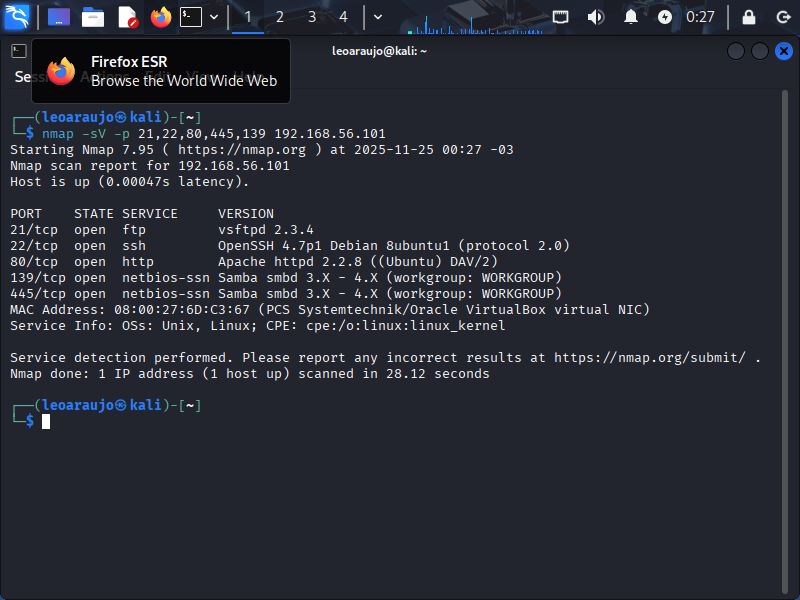
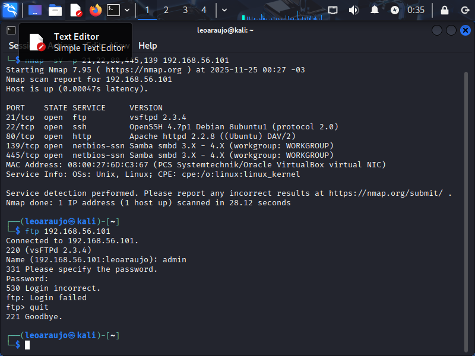
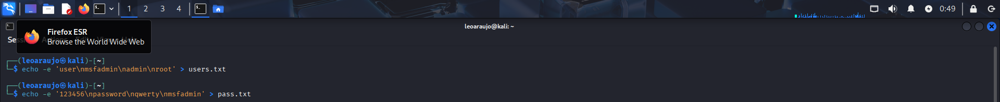
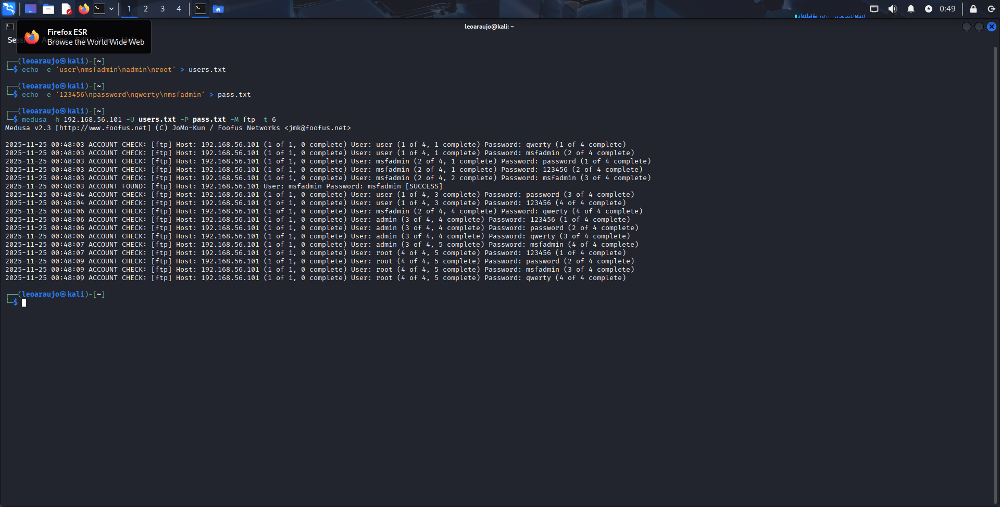
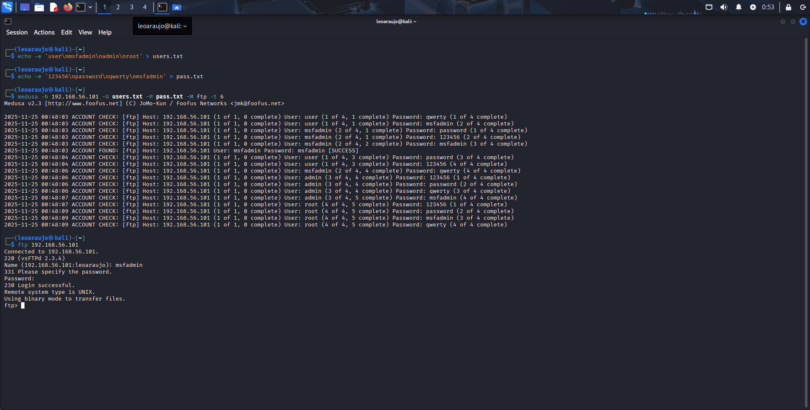

# Prática 1 – Ataque de Força Bruta em FTP usando Kali Linux + Medusa

Este laboratório tem como objetivo realizar um ataque de **força bruta no serviço FTP**
do Metasploitable 2, utilizando o Kali Linux como máquina atacante.  
Seguindo boas práticas de auditoria, realizamos enumeração, criação de wordlists simples,
ataque com Medusa e validação do acesso descoberto.

---

##  Ambiente de Laboratório

| Máquina | IP | Função |
|--------|----|--------|
| **Kali Linux** | 192.168.56.102 | Atacante |
| **Metasploitable 2** | 192.168.56.101/24 | Alvo |
| **Rede** | Host-Only | Comunicação segura sem afetar rede real |

**Ambas as VMs funcionando corretamente.**

---

## 1. Introdução

O foco desta prática é o serviço **FTP** presente no Metasploitable 2, um servidor
vulnerável usado para fins educacionais.  
Simulamos um cenário onde um administrador mantém um **FTP antigo e inseguro**, permitindo
a um atacante:

- descobrir a existência do serviço  
- testar nomes de usuários prováveis  
- tentar senhas comuns  
- validar o acesso obtido

O objetivo é entender como ataques de força bruta funcionam em ambientes vulneráveis e
como se proteger.

---

## 2. Enumeração do Alvo (Nmap)

A primeira etapa de qualquer auditoria é descobrir **quais serviços estão ativos** no host.

Comando utilizado:

```bash
nmap -sV -p 21,22,80,445,139 192.168.56.101
```

*Imagem*: 

<a href="images1/nmap_enum.png">
    
</a>


O serviço FTP (porta 21) foi identificado como ativo.

## 3. Testando o serviço FTP diretamente

Após identificar a porta 21 aberta, testamos a conexão:

```bash
ftp 192.168.56.101
```

*Imagem*:

<a href="images1/ftp_test.png">
    
</a>


Conexão aceita → serviço realmente ativo.

## 4. Criando Wordlists (Usuários e Senhas)

Criamos duas listas simples para simulação:

Wordlist de usuários
```bash
echo -e 'user\nmsfadmin\nadmin\nroot' > users.txt
```
```bash
Wordlist de senhas
echo -e '123456\npassword\nqwerty\nmsfadmin' > pass.txt
```

Essas listas ficaram armazenadas no diretório atual do Kali.

*Imagem*:

<a href="images1/wordlists.png">
    
</a>


## 5. Ataque de Força Bruta com Medusa

Rodamos o ataque usando protocolos FTP:

```bash
medusa -h 192.168.56.101 -U users.txt -P pass.txt -M ftp -t 6
```


Parâmetros importantes:

**-h → host alvo**

**-U → wordlist de usuários**

**-P → wordlist de senhas**

**-M ftp → módulo do Medusa**

**-t 6 → threads simultâneas**

*Imagem*:

<a href="images1/medusa_attack.png">
    
</a>


Resultado:

Credenciais encontradas:

*- Usuário: msfadmin*  
*- Senha: msfadmin*

## 6. Validando o Acesso Descoberto

Testamos novamente o login no FTP usando as credenciais descobertas:

```bash
ftp 192.168.56.101
```

*Imagem*:

<a href="images1/ftp_success.png">
    
</a>


Login efetuado com sucesso. O ataque funcionou.

## 7. Medidas de Mitigação

Com base no teste realizado, as seguintes recomendações reduzem drasticamente
a chance de ataques de força bruta:

- Utilizar senhas fortes e únicas

- Desabilitar serviços não utilizados (FTP é inseguro por padrão)

- Implementar fail2ban ou bloqueio de IP após tentativas falhas

- Atualizar sistemas e serviços legados

- Usar protocolos seguros como SFTP ou FTPS

- Monitorar logs de autenticação


## Notas e Observações

A comunicação entre as máquinas foi testada com:

```bash
ping -c 3 192.168.56.101
```

Tudo funcionou corretamente em rede Host-Only.

Wordlists simples foram suficientes pois o alvo é propositalmente vulnerável.

## Conclusão

Nesta prática, executamos um ataque real de força bruta contra um serviço FTP vulnerável,
utilizando Medusa no Kali Linux.
O laboratório permitiu compreender cada etapa do processo:
enumeração → wordlists → ataque → validação → mitigação.

Essa documentação demonstra entendimento técnico e um fluxo claro de auditoria em
ambiente controlado.
